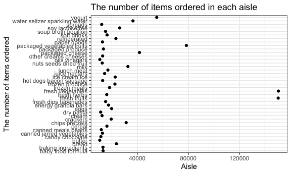
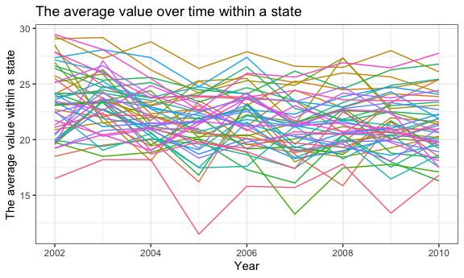

p8105\_hw3\_yy2912
================

\#question 1: load instacart data

``` r
library(p8105.datasets)
data("instacart")
```

There are 1384617 rows and 15 columns in data ‘instacart’. There are 134
distinct aisel. Some key variables include 131209 distinct order\_id and
131209 distinct user\_id.

\#question 1: how many aisles are there, and which aisles are the most
items ordered from?

``` r
numberof_aisle=
instacart %>%
  group_by(aisle) %>%
  summarize(n=n())%>%
  arrange(desc(n))
```

There are 134 aisles and most items are orderd from “fresh vegetables”.

\#question 1: make a plot that shows the number of items ordered in each
aisle, limiting this to aisles with more than 10000 items ordered

``` r
plot_aisle =
  numberof_aisle %>%
  filter(n>10000)%>%
  ggplot(aes(x=n, y=aisle))
plot_aisle+geom_point()+theme(
          legend.position="none") +
  xlab("Aisle")+
  ylab("The number of items ordered") +
  ggtitle("The number of items ordered in each aisle")
```



\#question 1: make a table showing the three most popular items in each
of the aisles “baking ingredients”, “dog food care”, and “packaged
vegetables fruits”. Include the number of times each item is ordered in
your table.

``` r
popular_item=
  instacart %>%
  filter(aisle == c("baking ingredients","dog food care","packaged vegetables fruits"))%>%
  group_by(product_name, aisle)%>%
  summarize(
    n = n()
  ) %>% 
 group_by(aisle) %>% 
  summarize(
    rank=max(n))%>%
  top_n(3)%>%
  knitr::kable()
```

    ## Selecting by rank

\#question 1: make a table showing the mean hour of the day at which
Pink Lady Apples and Coffee Ice Cream are ordered on each day of the
week.

``` r
instacart %>%
  filter(product_name==c("Pink Lady Apples","Coffee Ice Cream"))%>%

  group_by(product_name, order_dow)%>%
  summarize(mean_hour=mean(order_hour_of_day))%>%
  knitr::kable()
```

    ## Warning in product_name == c("Pink Lady Apples", "Coffee Ice Cream"):
    ## longer object length is not a multiple of shorter object length

| product\_name    | order\_dow | mean\_hour |
| :--------------- | ---------: | ---------: |
| Coffee Ice Cream |          0 |   13.22222 |
| Coffee Ice Cream |          1 |   15.00000 |
| Coffee Ice Cream |          2 |   15.33333 |
| Coffee Ice Cream |          3 |   15.40000 |
| Coffee Ice Cream |          4 |   15.16667 |
| Coffee Ice Cream |          5 |   10.33333 |
| Coffee Ice Cream |          6 |   12.35294 |
| Pink Lady Apples |          0 |   12.25000 |
| Pink Lady Apples |          1 |   11.67857 |
| Pink Lady Apples |          2 |   12.00000 |
| Pink Lady Apples |          3 |   13.93750 |
| Pink Lady Apples |          4 |   11.90909 |
| Pink Lady Apples |          5 |   13.86957 |
| Pink Lady Apples |          6 |   11.55556 |

\#question 2:

``` r
library(p8105.datasets)
data("brfss_smart2010")
brfss = janitor::clean_names(brfss_smart2010) %>% 
  mutate(
    response = factor(response, levels = c("Poor", "Fair", "Good", "Very Good", "Excellent"))
    )
```

\#question 2: format the data to use appropriate variable names;focus on
the “Overall Health” topic; include only responses from “Excellent” to
“Poor”; organize responses as a factor taking levels ordered from
“Poor” to “Excellent”

``` r
brfss %>%
  filter(
    topic == "Overall Health",
    response == c("Excellent", "Very good", "Good", "Fair", "Poor")
  ) %>% 
  arrange(response) 
```

    ## Warning in `==.default`(response, c("Excellent", "Very good", "Good",
    ## "Fair", : longer object length is not a multiple of shorter object length

    ## Warning in is.na(e1) | is.na(e2): longer object length is not a multiple of
    ## shorter object length

    ## # A tibble: 1,613 x 23
    ##     year locationabbr locationdesc class topic question response
    ##    <int> <chr>        <chr>        <chr> <chr> <chr>    <fct>   
    ##  1  2010 AL           AL - Jeffer… Heal… Over… How is … Poor    
    ##  2  2010 AZ           AZ - Pinal … Heal… Over… How is … Poor    
    ##  3  2010 CA           CA - Alamed… Heal… Over… How is … Poor    
    ##  4  2010 CA           CA - Rivers… Heal… Over… How is … Poor    
    ##  5  2010 CA           CA - San Be… Heal… Over… How is … Poor    
    ##  6  2010 CO           CO - Dougla… Heal… Over… How is … Poor    
    ##  7  2010 CO           CO - Jeffer… Heal… Over… How is … Poor    
    ##  8  2010 CT           CT - Hartfo… Heal… Over… How is … Poor    
    ##  9  2010 DE           DE - Kent C… Heal… Over… How is … Poor    
    ## 10  2010 FL           FL - Baker … Heal… Over… How is … Poor    
    ## # … with 1,603 more rows, and 16 more variables: sample_size <int>,
    ## #   data_value <dbl>, confidence_limit_low <dbl>,
    ## #   confidence_limit_high <dbl>, display_order <int>,
    ## #   data_value_unit <chr>, data_value_type <chr>,
    ## #   data_value_footnote_symbol <chr>, data_value_footnote <chr>,
    ## #   data_source <chr>, class_id <chr>, topic_id <chr>, location_id <chr>,
    ## #   question_id <chr>, respid <chr>, geo_location <chr>

\#question 2: In 2002, which states were observed at 7 or more
locations? What about in 2010?

``` r
sevenormore_location=
  brfss %>% 
  filter(year == 2002) %>% 
  group_by(locationabbr) %>% 
  summarize(
    n = n()
  ) %>% 
  filter(n >= 7) %>% 
  arrange(n) 
```

In 2002, the 7 states that were observed at 7 or more locations are RI,
GA, ME, OH, MA, NJ, and PA.

``` r
sevenormore_location=
  brfss %>% 
  filter(year == 2010) %>% 
  group_by(locationabbr) %>% 
  summarize(
    n = n()
  ) %>% 
  filter(n >= 7) %>% 
  arrange(n) 
```

In 2010, the 15 states that were observed at 7 or more locations are NC,
PA, OH, SC, UT, CO, ID, MA, ME, TN, NY, CA, MD, TX, and FL.

\#question 2: Construct a dataset that is limited to Excellent
responses, and contains, year, state, and a variable that averages the
data\_value across locations within a state.

``` r
brfss_new =
  brfss %>% 
  filter(response == "Excellent") %>% 
  group_by(year, locationabbr) %>% 
  mutate(mean = mean(data_value, na.rm = FALSE)) %>%
  select(year, locationabbr, mean) %>% 
  distinct() 
```

\#question 2: Make a “spaghetti” plot of this average value over time
within a
state.

``` r
  ggplot(brfss_new, aes(x = year, y = mean, color = locationabbr, group = locationabbr))+
  geom_line() +
  theme(legend.position="none") +
  xlab("Year") +
  ylab("The average value within a state") +
  ggtitle("The average value over time within a state")
```

    ## Warning: Removed 3 rows containing missing values (geom_path).


\#question 2: Make a two-panel plot showing, for the years 2006, and
2010, distribution of data\_value for responses (“Poor” to “Excellent”)
among locations in NY State.

response\_2006 = brfss %\>% filter(year == 2006) %\>% ggplot(aes(x =
data\_value, fill = response)) + geom\_density(color=data\_value, alpha
= .5) + theme(legend.position = “bottom”)

``` r
response_2006 = 
  brfss %>% 
  filter(year == 2006) %>% 
  ggplot(aes(x = data_value, fill = response)) +
  geom_density(alpha = .5) +
  theme(legend.position = "bottom")+
    viridis::scale_fill_viridis(discrete = TRUE)
```

``` r
response_2010 = 
  brfss %>% 
  filter(year == 2010) %>% 
  ggplot(aes(x = data_value, fill = response)) +
 geom_density(alpha = .5) +
  theme(legend.position = "bottom")+
    viridis::scale_fill_viridis(discrete = TRUE)
```

``` r
library(patchwork)
(response_2006 + response_2010)
```

    ## Warning: Removed 686 rows containing non-finite values (stat_density).

    ## Warning: Removed 558 rows containing non-finite values (stat_density).


\#question 3: Load, tidy, and otherwise wrangle the data. Your final
dataset should include all originally observed variables and values;
have useful variable names; include a weekday vs weekend variable; and
encode data with reasonable variable classes. Describe the resulting
dataset (e.g. what variables exist, how many observations, etc).

``` r
accel_data = read_csv(file = "./data/accel_data.csv")%>% 
janitor::clean_names() 
```

    ## Parsed with column specification:
    ## cols(
    ##   .default = col_double(),
    ##   day = col_character()
    ## )

    ## See spec(...) for full column specifications.

``` r
accel_data_tidy = 
        accel_data %>% 
        pivot_longer(
        activity_1:activity_1440,
        names_to = "activity",
        values_to = "activity_minutes"
    ) %>%
  
   mutate(
      day = factor(day, levels = c("Monday", "Tuesday", "Wednesday", "Thursday", "Friday", "Saturday", "Sunday" )), 
      weekend = day %in% c("Saturday", "Sunday")
    ) %>% 
 
 mutate(
    week = as.integer(week),
    day_id = as.integer(day_id),
    day = as.character(day),
    activity = as.character(activity),
    activity_minutes = as.numeric(activity_minutes),
    weekend = as.numeric(weekend)
  )
```

The variables in the tidied dataset include: activity,
activity\_minutes, day, day\_id, week, weekend and there are 50400
observations in the dataset.

\#question 3: Using your tidied dataset, aggregate accross minutes to
create a total activity variable for each day, and create a table
showing these totals. Are any trends apparent?

``` r
accel_data_tidy %>% 
  group_by(day_id) %>% 
  mutate(total_activity = sum(activity_minutes)) %>%
  select(week, day_id, day, weekend, total_activity) %>% 
  distinct() %>% 
  knitr::kable()
```

|    week |   day\_id | day         |    weekend |                                                                     total\_activity |
| ------: | --------: | :---------- | ---------: | ----------------------------------------------------------------------------------: |
|       1 |         1 | Friday      |          0 |                                                                           480542.62 |
|       1 |         2 | Monday      |          0 |                                                                            78828.07 |
|       1 |         3 | Saturday    |          1 |                                                                           376254.00 |
|       1 |         4 | Sunday      |          1 |                                                                           631105.00 |
|       1 |         5 | Thursday    |          0 |                                                                           355923.64 |
|       1 |         6 | Tuesday     |          0 |                                                                           307094.24 |
|       1 |         7 | Wednesday   |          0 |                                                                           340115.01 |
|       2 |         8 | Friday      |          0 |                                                                           568839.00 |
|       2 |         9 | Monday      |          0 |                                                                           295431.00 |
|       2 |        10 | Saturday    |          1 |                                                                           607175.00 |
|       2 |        11 | Sunday      |          1 |                                                                           422018.00 |
|       2 |        12 | Thursday    |          0 |                                                                           474048.00 |
|       2 |        13 | Tuesday     |          0 |                                                                           423245.00 |
|       2 |        14 | Wednesday   |          0 |                                                                           440962.00 |
|       3 |        15 | Friday      |          0 |                                                                           467420.00 |
|       3 |        16 | Monday      |          0 |                                                                           685910.00 |
|       3 |        17 | Saturday    |          1 |                                                                           382928.00 |
|       3 |        18 | Sunday      |          1 |                                                                           467052.00 |
|       3 |        19 | Thursday    |          0 |                                                                           371230.00 |
|       3 |        20 | Tuesday     |          0 |                                                                           381507.00 |
|       3 |        21 | Wednesday   |          0 |                                                                           468869.00 |
|       4 |        22 | Friday      |          0 |                                                                           154049.00 |
|       4 |        23 | Monday      |          0 |                                                                           409450.00 |
|       4 |        24 | Saturday    |          1 |                                                                             1440.00 |
|       4 |        25 | Sunday      |          1 |                                                                           260617.00 |
|       4 |        26 | Thursday    |          0 |                                                                           340291.00 |
|       4 |        27 | Tuesday     |          0 |                                                                           319568.00 |
|       4 |        28 | Wednesday   |          0 |                                                                           434460.00 |
|       5 |        29 | Friday      |          0 |                                                                           620860.00 |
|       5 |        30 | Monday      |          0 |                                                                           389080.00 |
|       5 |        31 | Saturday    |          1 |                                                                             1440.00 |
|       5 |        32 | Sunday      |          1 |                                                                           138421.00 |
|       5 |        33 | Thursday    |          0 |                                                                           549658.00 |
|       5 |        34 | Tuesday     |          0 |                                                                           367824.00 |
|       5 |        35 | Wednesday   |          0 |                                                                           445366.00 |
| There i | s not any | apparent tr | end from t | he table generated. Each week has different activity minutes from Monday to Sunday. |
